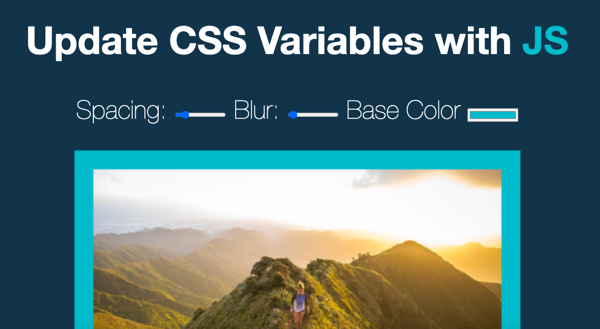

# Javascript30-3
 This is a 30 day JavaScript Challenge. Challenge #3 CSS Variables
 
## Table of contents

- [Overview](#overview)
  - [The challenge](#the-challenge)
  - [Screenshot](#screenshot)
  - [Links](#links)
- [My process](#my-process)
  - [Built with](#built-with)
  - [What I learned](#what-i-learned)
  - [Continued development](#continued-development)
  - [Useful resources](#useful-resources)
- [Author](#author)

## Overview

### The challenge

- Build out the project to the designs provided

### Screenshot




### Links

- Solution URL: [https://github.com/kryde507/JavaScript30-3](https://github.com/kryde507/JavaScript30-3)

## My process

### Built with

- Vanilla JavaScript
- CSS Variables 

### What I learned

In this project I learned about CSS variables and how to update them with JavaScript.


The following CSS snippet is used to set the variables:
```css
:root {
    --main-color: #006854;
    --blur: 10px;
    --spacing: 10px;
}
```


### Continued development

I would like to use CSS variables in a larger project where I do not have a starter code.  

### Useful resources

- [CSS Tricks - CSS Variables](https://css-tricks.com/updating-a-css-variable-with-javascript/) - This helped me understand how to use Javascript to update CSS variables.

## Author

- GitHub - [KRyde507](https://github.com/kryde507)

